# Object Detection in an Urban Environment
In this project, I have used object detection algorithms to train a model using [Waymo Open dataset](https://waymo.com/open/) that enables detecting three classes of objects (`vehicle`, `pedestrian`, and `cyclist`) in an urban environment. 
## Data

For this project, I have used data from the [Waymo Open dataset](https://waymo.com/open/). The files can be downloaded directly from the website as tar files or from the [Google Cloud Bucket](https://console.cloud.google.com/storage/browser/waymo_open_dataset_v_1_2_0_individual_files/) as individual `tfrecords`.

Note that in this project, I have only used data obtained by camera sensors in form of 2D images to detect objects.

## Structure
The models trained on the abovementioned dataset are organized in the following path:
```
training/
    - pretrained-models/: contains the checkpoints of the pretrained models.
    - reference/
    - modified_model_1/
    - modified_model_2/
    - modified_model_3/
```
Each path contains the `config` file associated with an experiment. Details of each models are provided in the section about [Training](#Training)

The data was downloaded on an Google Cloud Virtual Machine and was preprocessed, and splitted into three folders as follows:
```
data/preprocessed/
    - train:    contains the train data
    - test:     contains the test data
    - val:      contains the validation data
```

## Prerequisites and Local Setup
The project was conducted on a Google Cloud Virtual Machine with a GPU (NVIDIA Tesla T4) and 30 GB of memory. To set the local machine, the following step was performed: 

- Requirements
    - NVIDIA GPU with the latest driver installed
    - docker / nvidia-docker

For the local setup, the provided Dockerfile and requirements in the [build directory](./build) must be used.

 A docker container was created and prerequisites were installed according to [the README therein](./build/README.md):

- Build the image
```
docker build -t project-dev -f Dockerfile .
```
- Create a container with the following and any other flag found useful to your system (eg, `--shm-size`).
```
docker run --gpus all -v <PATH TO LOCAL PROJECT FOLDER>:/app/project/ --network=host -ti project-dev bash
```
- Once in container, you will need to install gsutil, which you can easily do by running:
```
curl https://sdk.cloud.google.com | bash
```
- Once gsutil is installed and added to your path, you can auth using:
```
gcloud auth login
```

## Instructions

### Download and process the data
The first goal of this project was to download the data from the Waymo's Google Cloud bucket to the local machine. For this project, I only needed a subset of the data provided (for example, I do not need to use the Lidar data). Therefore, I downloaded and trimmed immediately each file:

In `download_process.py`, there is a function called `create_tf_example`, which performs this processing. This function takes the components of a Waymo Tf record and saves them in the Tf Object Detection api format. An example of such function is described [here](https://tensorflow-object-detection-api-tutorial.readthedocs.io/en/latest/training.html#create-tensorflow-records). The `label_map.pbtxt` file was already provided.

I ran the script using the following (you will need to add your desired directory names):
```
python download_process.py --data_dir {processed_file_location} --temp_dir {temp_dir_for_raw_files}
```
There were 100 `tfrecord` files. Once the script is done, you can look inside your `data_dir` folder to see if the files have been downloaded and processed correctly.


### Exploratory Data Analysis

Open the `Exploratory Data Analysis` notebook. Make sure that [Seaborn](https://seaborn.pydata.org/installing.html) and [Pandas](https://pandas.pydata.org/docs/getting_started/install.html) are installed.

**First**, I familiarized myself with the data, its structure and its attributes. I used some of the attiributes such as `take` and `get_single_element` to access an image as a single element in the dataset. This shows that each element in the dataset is in the form of a `ditctionary` with different `keys`. These `keys` for a single element can be obtained via `output_shapes` and `element_spec` can show what kind of information.

**Second**, I implemented a `display_instances` function to display images and annotations using `matplotlib`. In this function, I used the following keys: 
- `image`: used to access the image as an array
- `original_image_spatial_shape`: used to access the dimensions of the image
- `groundtruth_boxes`: used to access the coordinates of the groundtruth bounding boxes
- `groundtruth_classes`: used to access the groundtruth classess

10 random images with the associated bounding boxes were displayed. The methods `take` and `shuffle` on the dataset was used. A sample output of this function can be seen below:

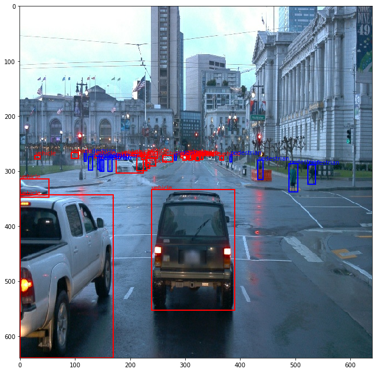

**Third**, I implemented function `statistics_of_image` that computes some statistics for a single element in the dataset. Specifically, this function takes an element (image) of the dataset and returns a `Pandas DataFrame` including filename, classes associated with the bounding boxes, the relative area of the bounding boxes w.r.t. the image area, the area of the bounding boxes.

**Fourth**, a batch of dataset with a size 0f 20,000 images was used to perform statistics. The DataFrame associated with each image in the batch was concatenated to a main DataFrame containing statistics of 20,000 images. This main DataFrame was used to visualize the statistics as follows:

#### Count of Classes:
 The figure below shows the count of each class (`vehicle`, `pedestrian`, `cyclist`) in the batch. Most of the bounding boxes in the dataset are labeled as `vehicle`. Bounding boxes labeled as `pedestrian` are less than one-third of those labeled as `vehicle`. There are very few bounding boxes labeled as `cyclist`. Therefore:
- The classes are not balanced
- The model could have difficulty identifying `cyclisits` compared to `vehicles` or `pedestrians`

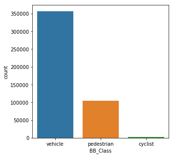

#### Relative and Absolute Area of the Bounding Boxes:
The figure below shows the relative and absolute area of the bounding boxes for each class (`vehicle`, `pedestrian`, `cyclist`) in the dataset. The `boxplot` below shows that there are outliers. These outliers represent those objects that were too close to the cameras. For instance, a relative area of 1 for `pedestrian` bounding box shows that the corresponding image contains only one object.

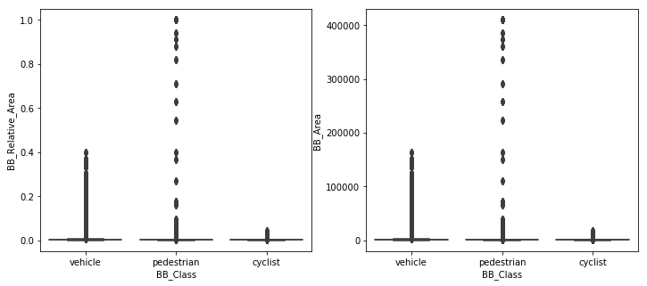

To have a better understanding, the boxplot below shows the relative and absolute areas after removing outliers. This plot shows that bounding boxes oftentimes occupy a small portion of an image for all three classes (`vehicle`, `pedestrian`, `cyclist`)

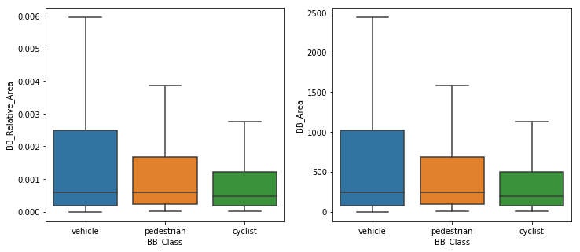

The `stripplot` below shows that those images with large bounding boxes are very few and most of the dataset contain images that have small bounding boxes for all classes. There are some pedestrains that are too close to the camera occupying a major proportion of the image. In some cases, the relative area for pedestrians is equal to 1.

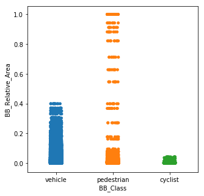

#### Distribution of Classes:
The `barplot` below shows:
- Most of the images either contain both `vehicle` and `pedestrian` classes or only `vehicle`.
- Images containing all three classes (`vehicle`, `pedestrian`, `cyclist`) are small portion of the dataset.
- There are very few images containing only `cyclist`, only `pedestrian`, both `cyclist` and `pedestrian`, and both `cyclist` and `vehicle`.


#### Number of each class per image (Class Frequency):
The DataFrame `df_class_freq` shows the number of each class per each image. The `stripplot` shows that:
- `vehicle`: between 0 and ~70 times per image
- `pedestrian`: between 0 and ~45 times per image
- `cyclist`: between  0 and ~5 times per image

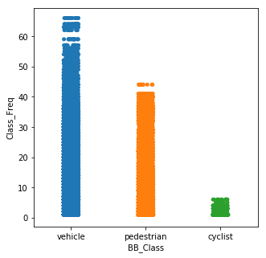

#### Weather, light, traffic conditions in a sample batch:
Taking samples shows that even in a small batch of data (10 images) I can have different `weather` conditions (e.g., sunny/cloudy), different `light` conditions (e.g., day/night), and different `traffic` conditions (e.g., crowded, non-crowded streets)

### Create the splits

I implemented the `split_data` function in the `create_splits.py` file for splitting data into the training (60%), validation (20%), and testing (20%) sets:
```
python create_splits.py --data_dir ./data/preprocessed_data/
```
NOTE: Keep in mind that if your storage is limited, you can use `os.rename(current_dir, new_dir)` instead of `shutil.copy(current_dir, new_dir)` to move the files instead of copying them. 

Note that, shuffling dataset before splitting is not recommended since consecutive frames (e.g., frames in one single trip) should not be splitted into training and testing sets. 

### Edit the config file

The Tf Object Detection API relies on **config files**. I used three pretrained models as follows:

- Pretrained model 1: SSD Resnet 50 v1 fpn 640x640 model
- Pretrained model 2: SSD Resnet 101 v1 fpn 640x640 model
- Pretrained model 3: Faster-RCNN Resnet 50 v1 fpn 640x640 model

First, the [pretrained model 1](http://download.tensorflow.org/models/object_detection/tf2/20200711/ssd_resnet50_v1_fpn_640x640_coco17_tpu-8.tar.gz), [pretrained model 2](http://download.tensorflow.org/models/object_detection/tf2/20200711/ssd_resnet101_v1_fpn_640x640_coco17_tpu-8.tar.gz), and [pretrained model 3](http://download.tensorflow.org/models/object_detection/tf2/20200711/faster_rcnn_resnet50_v1_640x640_coco17_tpu-8.tar.gz) were downloaded and moved to `training/pretrained-models/`. 

Now I need to edit the config files to change the location of the training and validation files, as well as the location of the label_map file, pretrained weights. I also need to adjust the batch size. To do so, run the following commands:

`pretrained model 1: SSD Resnet 50 v1 fpn 640x640 model `
```
python edit_config.py --train_dir /app/project/Udacity_Object_Detection_Project/data/preprocessed_data/train/ --eval_dir /app/project/Udacity_Object_Detection_Project/data/preprocessed_data/val/ --batch_size 4 --checkpoint ./training/pretrained-models/ssd_resnet50_v1_fpn_640x640_coco17_tpu-8/checkpoint/ckpt-0 --label_map label_map.pbtxt
```

` pretrained model 2: SSD Resnet 101 v1 fpn 640x640 model `
```
python edit_config.py --train_dir /app/project/Udacity_Object_Detection_Project/data/preprocessed_data/train/ --eval_dir /app/project/Udacity_Object_Detection_Project/data/preprocessed_data/val/ --batch_size 4 --checkpoint ./training/pretrained-models/ssd_resnet101_v1_fpn_640x640_coco17_tpu-8/checkpoint/ckpt-0 --label_map label_map.pbtxt
```

` pretrained model 3: Faster-RCNN Resnet 50 v1 fpn 640x640 model `
```
python edit_config.py --train_dir /app/project/Udacity_Object_Detection_Project/data/preprocessed_data/train/ --eval_dir /app/project/Udacity_Object_Detection_Project/data/preprocessed_data/val/ --batch_size 4 --checkpoint ./training/pretrained-models/faster_rcnn_resnet50_v1_640x640_coco17_tpu-8/checkpoint/ckpt-0 --label_map label_map.pbtxt
```
Note that the `pipeline.config` file in the main directory  is unique for each architecture and the raw `pipeline.config` for each architecture must be copied to main directory from `training/pretrained-models/` before running the above commands

Note, after running abovementioned commands, a new config file is created, `pipeline_new.config` which were moved to: 

training/
- reference/: contains the config file (`pipeline_new.config`) of pretrained model 1
- modified_model_1/: contains the config file (`pipeline_new.config`) of pretrained model 1 with some modifications explained in the following section.
- modified_model_2/: contains the config file (`pipeline_new.config`) of pretrained model 2 with some modifications explained in the following section.
- modified_model_3/: contains the config file (`pipeline_new.config`) of pretrained model 3 with some modifications explained in the following section.


### Training

### Reference model experiment

I ran the first experiment with the Tensorflow object detection API. Create a folder `training/reference`. Move the `pipeline_new.config` to this folder. You will now have to launch two processes: 
* Training process for `reference: SSD Resnet 50 640x640 model`:

```
nohup python experiments/model_main_tf2.py --model_dir=training/reference/ --pipeline_config_path=training/reference/pipeline_new.config > training_log.log &
```

* Evaluation process for `reference: SSD Resnet 50 640x640 model`:
```
nohup python experiments/model_main_tf2.py --model_dir=training/reference/ --pipeline_config_path=training/reference/pipeline_new.config --checkpoint_dir=training/reference/  > eval_log.log &
```

To monitor the training, I can launch a tensorboard instance by running:
```
nohup tensorboard --logdir=training > tensorboard_log.log &
```

### Improve the performance other models

**Aumentations:** To make the performance of the reference model better, I used augmentation strategy based on the [`preprocessor.proto`](https://github.com/tensorflow/models/blob/master/research/object_detection/protos/preprocessor.proto) file that contains the different data augmentation method available in the Tf Object Detection API. 

To help you visualize these augmentations, a Jupyter notebook `Explore augmentations.ipynb` is provided. Using this notebook, I tried different data augmentation combinations and select the following:

- `random_horizontal_flip`: helps better learn objects' feautres
- `random_crop_image`: helps detecting objects that are partially visible
- `random_pixel_value_scale`: helps better learn objects' features by increasing color variability
- `random_image_scale`: helps learn objects' features with various sizes by scaling the images 
- `random_rgb_to_gray`: helps learn objects' features irrespective their color
- `random_adjust_brightness`: helps learn objects' features no matter what day-time is
- `random_adjust_contrast`: helps learn objects' features irrespective image quality
- `random_adjust_hue`: helps learn objects' features irrespective image quality
- `random_adjust_saturation`: helps learn objects' features irrespective image quality
- `random_black_patches`: helps detecting objects that are partially covered/blocked
- `random_jpeg_quality`: helps learn objects' features irrespective image quality

Some examples can be found in this directory: `.Figure/Augmentations/`, Some examples are demonstrated below: 

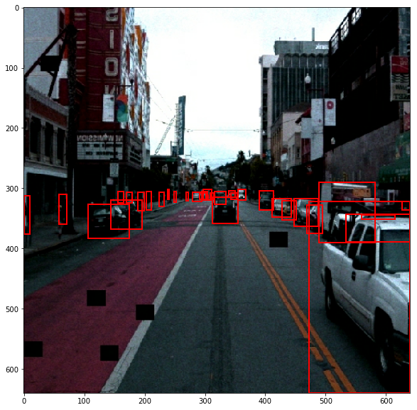
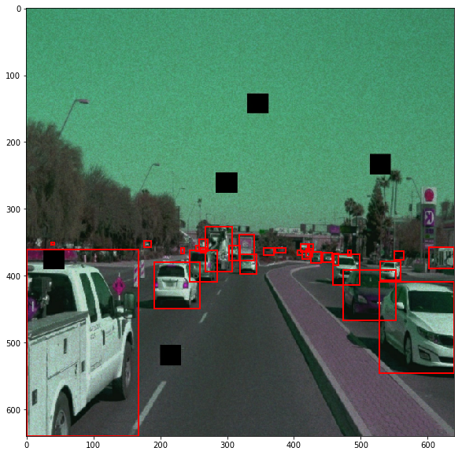
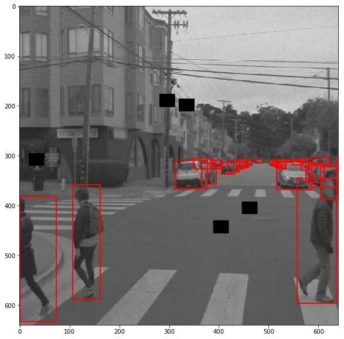
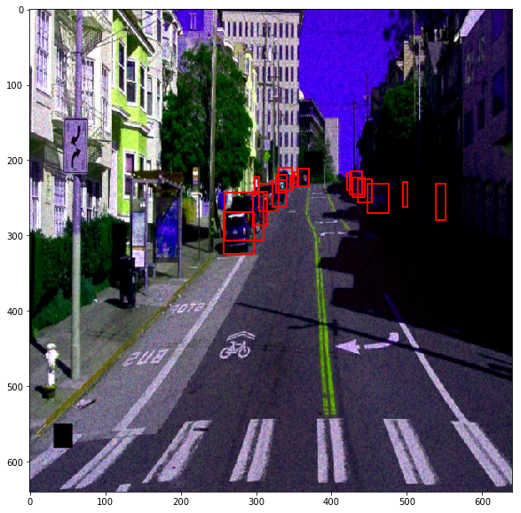
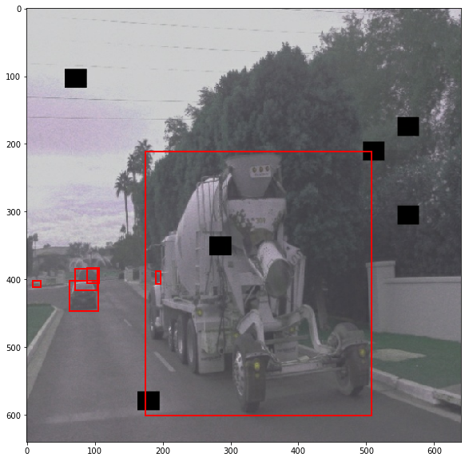
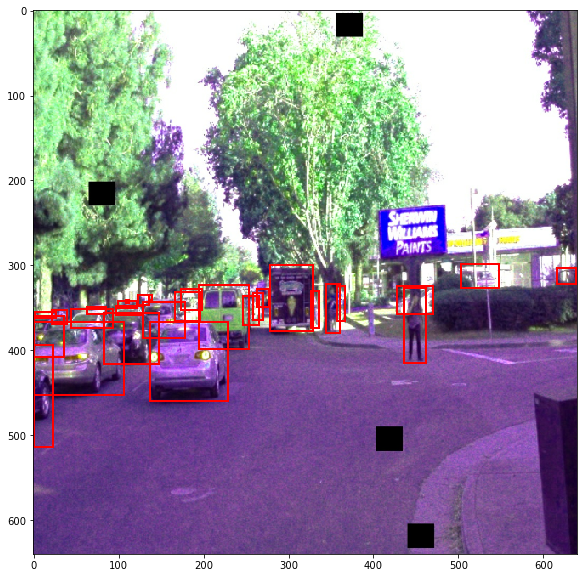


**Optimizer:** I also experimented with the optimizer, learning rate, and scheduler. I used `Adam_optimizer` with `exponential_decay_learning_rate` and set the  following parameters:
- `initial_learning_rate`: 0.001
- `decay_steps`: 5000
- `decay_factor`: 0.95
- `min_learning_rate`: 0.00001

As mentioned before, I experimented with the different architectures. The Tf Object Detection API [model zoo](https://github.com/tensorflow/models/blob/master/research/object_detection/g3doc/tf2_detection_zoo.md) offers many architectures. 

I experimented with:
- `modified model 1: SSD Resnet 50 640x640 model` with abovmentioned augmentations, Adam optimizer, and exponential decay learining rate scheduler. This shows if Adam optimizer with exponeial decay scheduler could help with the performance.

- `modified model 1: SSD Resnet 101 640x640 model` with abovmentioned augmentations, Adam optimizer, and exponential decay learining rate scheduler. This shows if a deeper network could help with the performance.
- `modified model 3: Faster-RCNN Resnet 50 640x640 model` with abovmentioned augmentations, Adam optimizer, and exponential decay learining rate scheduler. This shows the difference between SSD object detection and Faster-RCNN.


To run the training and evaluation processes for the modified models: 

* Training process for `modified model 1: SSD Resnet 50 640x640 model` with additional augmentations, Adam optimizer, and exponential decay learining rate scheduler:
```
nohup python experiments/model_main_tf2.py --model_dir=training/modified_model_1/ --pipeline_config_path=training/modified_model_1/pipeline_new.config > training_log.log &
```
* Evaluation process  for `modified model 1: SSD Resnet 50 640x640 model` with` additional augmentations, Adam optimizer, and exponential decay learining rate scheduler:
```
nohup python experiments/model_main_tf2.py --model_dir=training/modified_model_1/ --pipeline_config_path=training/modified_model_1/pipeline_new.config --checkpoint_dir=training/modified_model_1/ > eval_log.log &
```

* Training process for `modified model 2: SSD Resnet 101 640x640 model` with additional augmentations, Adam optimizer, and exponential decay learining rate scheduler:
```
nohup python experiments/model_main_tf2.py --model_dir=training/modified_model_2/ --pipeline_config_path=training/modified_model_2/pipeline_new.config > training_log.log &
```
* Evaluation process for `modified model 2: SSD Resnet 101 640x640 model` with additional augmentations, Adam optimizer, and exponential decay learining rate scheduler:
```
nohup python experiments/model_main_tf2.py --model_dir=training/modified_model_2/ --pipeline_config_path=training/modified_model_2/pipeline_new.config --checkpoint_dir=training/modified_model_2/ > eval_log.log &
```

* Training process for `modified model 3: Faster-RCNN Resnet 50 640x640 model` with additional augmentations, Adam optimizer, and exponential decay learining rate scheduler:
```
nohup python experiments/model_main_tf2.py --model_dir=training/modified_model_3/ --pipeline_config_path=training/modified_model_3/pipeline_new.config > training_log.log &
```
* Evaluation process for `modified model 3: Faster-RCNN Resnet 50 640x640 model` with additional augmentations, Adam optimizer, and exponential decay learining rate scheduler:
```
nohup python experiments/model_main_tf2.py --model_dir=training/modified_model_3/ --pipeline_config_path=training/modified_model_3/pipeline_new.config --checkpoint_dir=training/modified_model_3/ > eval_log.log &
```
### Training Loss
Deepening the network (`modified model 2 SSD Resnet 101`) compared to the initial architecture (`modified model 1: SSD Resnet 50`) did not significantly improve the loss. However, using Faster-RCNN object-detection (`modified model 3: Faster-RCNN Resnet 50`) instead of SSD object-detection significantly improved the loss after training. 

Note, I used augmentations as well as Adam optimizer with exponential-decay learning rate scheduler in the modified models 1 to 3. Adding augmentations can generalize the dataset when the data is limited and is recommended when training object detection models. I used Adam optimizer instead of Momentum optimizer. Adam optimizer combines the heuristics of both Momentum and RMSProp and therefore, could lead to better optimization during training. The exponential-decay learning rate scheduler changes the value of learning rate while the training progresses over time. Therefore, at the begining, the learning rate is large enough so the algorithm does not get stuck in local minima. As the training progresses over time, the learning rate decreases so the gradient descnet algorithm is guided to the global optima.   

**Increasing batch size could also lead to better performance; however, due to out-of-memory issue, it was not implemented in the experiments.**


### Evaluation Loss
The similar trend can be found in the evaluation loss values. Comparing the loss values of evaluation and training, we can see that overfitting did not occur and a convergence was achieved as can bee seen from the plateau  

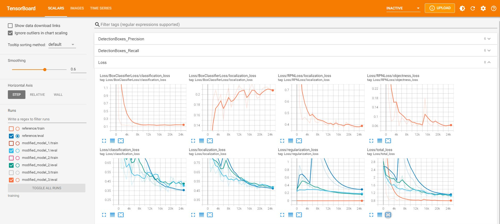

### Precision and Recall
It can be observed that adding augmentations and using Adam optimizer with exponental-dacy scheduler in `modified model 1 SSD Resnet 50` led to better precision and recall compared to the `reference model SSD Resnet 50`.

It can be observed that using deeper network in `modified model 2 SSD Resnet 101` compared to `modified model 1 SSD Resnet 50` led to poorer precision and recall. Therefore, `Resnet 50` was chosen for the next round of experiment with Faster-RCNN (`modified model 3 Faster-RCCN Resnet 50`). In addition, `modified model 3 Faster-RCCN Resnet 50` showed better precision and recall compated to other models. 

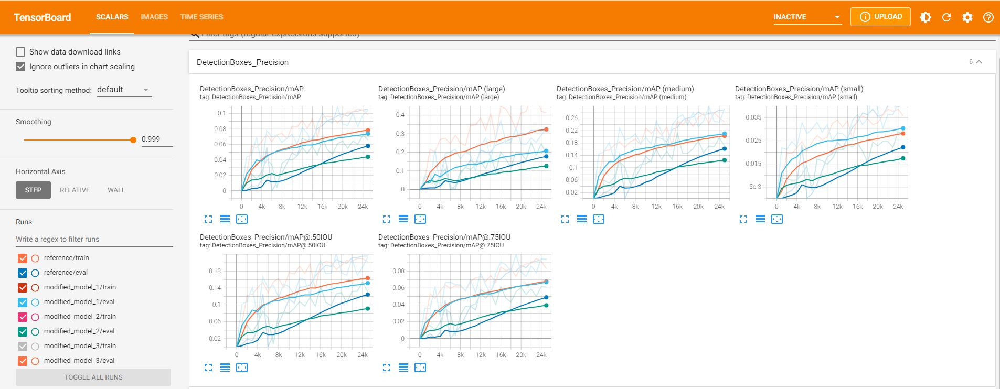


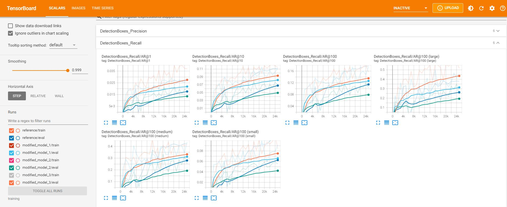


### Creating an animation
#### Export the trained model
To export the model, the following command was used (here only for `modified model 3`):

```
python experiments/exporter_main_v2.py --input_type image_tensor --pipeline_config_path training/modified_model_3/pipeline_new.config --trained_checkpoint_dir training/modified_model_3/my_checkpoint/ --output_directory training/modified_model_3/exported_model/
```

Finally, a video of the model's inferences was created for all tf record files in the test split. The following command was used:

` For a single tfrecord file in test split `
```
python inference_video.py --labelmap_path label_map.pbtxt --model_path training/modified_model_3/exported_model/saved_model --tf_record_path /app/project/Udacity_Object_Detection_Project/data/preprocessed_data/test/segment-1005081002024129653_5313_150_5333_150_with_camera_labels.tfrecord --config_path training/modified_model_3/pipeline_new.config --output_path animation.mp4
```

``` For all tfrecord files in test split ```
```
for file in data/preprocessed_data/test/*
do
filename="${file##*/}" 
filename="${filename%%.*}"
python inference_video.py --labelmap_path label_map.pbtxt --model_path training/modified_model_3/exported_model/saved_model --tf_record_path /app/project/Udacity_Object_Detection_Project/data/preprocessed_data/test/$filename.tfrecord --config_path training/modified_model_3/pipeline_new.config --output_path animation/$filename.mp4
done
```
The videos can be found in `.animation/`. Sample videos of object detection in different light, weather, and urban conditions:


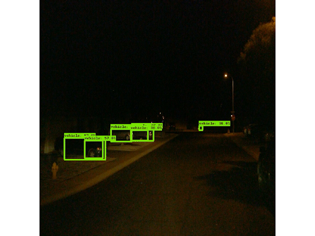
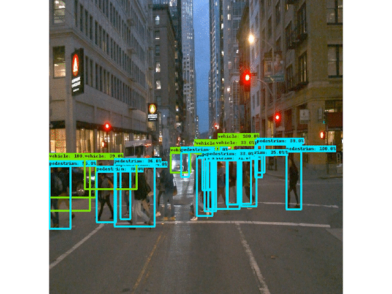


